# fouloid

Agents LangChain pilotés par messages Iggy, déployés sur Kubernetes via Fission. Chaque fouloid peut créer d'autres fouloids dynamiquement. Les communications entre agents sont authentifiées par signatures Ed25519.

## Commandes

```bash
pnpm start
pnpm dev
pnpm build
pnpm check
```

## Déploiement

### 1. Setup plateforme (une seule fois)

```bash
node scripts/setup-platform-key.mjs
# → coller la clé publique dans manifests/deploy-app.yaml sous PLATFORM_PUBLIC_KEY
```

### 2. Provisionner le premier fouloid

```bash
node scripts/provision-fouloid.mjs app fulloid
```

### 3. Déployer la CA et l'infrastructure

```bash
./scripts/deploy-ca.sh
kubectl apply -f manifests/
```

### 4. Tester la crypto

```bash
node scripts/test-identity.mjs
```

## Certificat — c'est quoi ?

Un certificat est un fichier JSON signé par la plateforme qui dit :
> "Je, la plateforme, certifie que cette clé publique appartient à `fouloid-alice`, valable jusqu'au `<date>`."

```json
{
  "agentName":          "fouloid-alice",
  "publicKey":          "-----BEGIN PUBLIC KEY-----\n...",
  "issuedAt":           1748390400000,
  "expiresAt":          1748476800000,
  "platformSignature":  "base64(sign(agentName+publicKey+issuedAt+expiresAt, clé_privée_plateforme))"
}
```

Chaque message envoyé contient ce certificat + une signature du message lui-même :

```json
{
  "id":          "1748390400000-abc123",
  "sender":      "fouloid-alice",
  "text":        "fais X",
  "timestamp":   1748390400000,
  "certificate": "base64(certificat ci-dessus)",
  "signature":   "base64(sign(id+sender+text+timestamp, clé_privée_alice))"
}
```

## Architecture

```mermaid
sequenceDiagram
    actor Opérateur
    participant K8s
    participant CA as fouloid-ca<br/>(Fission — la CA)
    participant App as fouloid-app<br/>(premier fouloid)
    participant CF as create-fulloid<br/>(Fission function)
    participant Child as fouloid-enfant
    participant Iggy

    rect rgb(220, 235, 255)
        Note over Opérateur,K8s: PHASE 1 — Setup plateforme (une seule fois)

        Note over Opérateur: génère une paire de clés Ed25519 :<br/>clé privée = tampon secret de la plateforme<br/>clé publique = partagée avec tous les fouloids
        Opérateur->>K8s: node setup-platform-key.mjs
        K8s-->>Opérateur: affiche la clé publique plateforme
        Opérateur->>K8s: kubectl create secret platform-signing-key<br/>(stocke la clé PRIVÉE — jamais partagée)
        Opérateur->>K8s: colle la clé PUBLIQUE dans<br/>ConfigMap app-config → PLATFORM_PUBLIC_KEY
    end

    rect rgb(220, 255, 230)
        Note over Opérateur,K8s: PHASE 2 — Provisioning du premier fouloid

        Note over Opérateur: Le premier fouloid n'a pas de parent pour le créer.<br/>C'est l'opérateur qui génère son identité à la main.<br/>Les fouloids suivants seront provisionnés par create-fulloid (phase 6).
        Opérateur->>K8s: node provision-fouloid.mjs app
        Note over K8s: 1. génère keypair Ed25519 pour fouloid-app<br/>   → privateKey (secrète) + publicKey (partageable)<br/>2. lit la clé privée plateforme depuis K8s<br/>3. crée le CERTIFICAT de fouloid-app :<br/>   signe { agentName:"app", publicKey, issuedAt, expiresAt }<br/>   avec la clé privée plateforme<br/>   → prouve que la plateforme reconnaît ce fouloid<br/>4. stocke privateKey + certificat dans un Secret K8s
        Opérateur->>K8s: crée Secret fouloid-app-keys<br/>contient FOULOID_PRIVATE_KEY et FOULOID_CERTIFICATE
    end

    rect rgb(255, 245, 220)
        Note over Opérateur,CA: PHASE 3 — Déploiement de la CA

        Note over CA: La CA est la seule entité autorisée<br/>à signer des certificats pour de nouveaux fouloids.<br/>Elle connaît la clé privée plateforme.<br/>Les fouloids ordinaires ne l'ont pas.
        Opérateur->>K8s: ./deploy-ca.sh
        K8s->>CA: crée la Fission function fouloid-ca<br/>monte le Secret platform-signing-key comme env var<br/>sous le ServiceAccount fouloid-ca (RBAC restreint)
        Note over CA: au démarrage :<br/>vérifie que PLATFORM_PRIVATE_KEY est présente<br/>plante immédiatement sinon
    end

    rect rgb(255, 225, 225)
        Note over App,Iggy: PHASE 4 — Démarrage du premier fouloid

        Opérateur->>K8s: kubectl apply -f manifests/
        K8s->>App: démarre le pod fouloid-app<br/>injecte depuis ConfigMap : PLATFORM_PUBLIC_KEY<br/>injecte depuis Secret    : FOULOID_PRIVATE_KEY<br/>                           FOULOID_CERTIFICATE<br/>                           OPENAI_API_KEY
        Note over App: getConfigFromEnv() vérifie que<br/>les 3 vars identité sont toutes présentes<br/>ou toutes absentes — sinon plantage immédiat
        App->>Iggy: connexion TCP
        App->>App: subscribe() sur le topic agent-input
        Note over App: reçoit le AGENT_KICKOFF :<br/>"crée une fonction create-fulloid<br/>puis crée un clone de toi-même"
    end

    rect rgb(235, 220, 255)
        Note over App,CF: PHASE 5 — Création de create-fulloid

        Note over App: Le LLM décide d'appeler l'outil create_function<br/>pour déployer la fonction qui saura créer des fouloids
        App->>CF: outil create_function → POST /deploy-pauline<br/>{ name:"create-fulloid", code:"..." }
        CF-->>App: { success: true }
        Note over CF: create-fulloid est maintenant disponible<br/>dans Fission — elle servira à créer<br/>tous les fouloids futurs
    end

    rect rgb(220, 255, 255)
        Note over App,Child: PHASE 6 — Création d'un fouloid enfant

        Note over App: Le LLM décide de créer un fouloid enfant<br/>en appelant la fonction create-fulloid
        App->>CF: POST /create-fulloid<br/>{ task: "surveille le namespace X" }
        Note over CF: génère une paire de clés Ed25519<br/>pour le futur fouloid-enfant
        CF->>CA: POST /fouloid-ca<br/>{ agentName:"fouloid-enfant", publicKey:"..." }
        Note over CA: valide agentName (lettres/chiffres/tirets)<br/>valide que publicKey est un PEM valide<br/>borne ttlMs entre 1 min et 30 jours<br/>crée et signe le CERTIFICAT :<br/>sign({ agentName, publicKey, issuedAt, expiresAt },<br/>      clé_privée_plateforme)<br/>→ ce certificat prouve que la plateforme<br/>  reconnaît fouloid-enfant comme légitime
        CA-->>CF: { certificate: "base64..." }
        CF->>K8s: crée Secret fouloid-enfant-keys<br/>(FOULOID_PRIVATE_KEY + FOULOID_CERTIFICATE)
        CF->>K8s: crée Deployment fouloid-enfant<br/>envFrom → app-config + fouloid-enfant-keys
        K8s->>Child: démarre le pod avec son identité injectée
        Child->>Iggy: connexion + subscribe() sur son topic
    end

    rect rgb(240, 255, 220)
        Note over App,Child: PHASE 7 — Communication sécurisée entre fouloids

        Note over App: À chaque message envoyé, le fouloid :<br/>1. calcule un payload = id+sender+text+timestamp<br/>2. signe ce payload avec sa clé privée<br/>3. joint son certificat au message<br/>→ le destinataire peut vérifier QUI a envoyé<br/>  et que le contenu n'a pas été modifié
        App->>Iggy: publie sur agent-output<br/>{ id, sender, text, timestamp, certificate, signature }
        Iggy->>Child: livre le message sur agent-input

        Note over Child: VÉRIFICATION en 6 étapes :<br/>1. certificate et signature présents ?<br/>   → sinon : rejet (message non signé)<br/>2. cert.expiresAt est bien un nombre ?<br/>   → sinon : rejet (certificat malformé)<br/>3. Date.now() < cert.expiresAt ?<br/>   → sinon : rejet (certificat expiré)<br/>4. signature du certificat valide avec PLATFORM_PUBLIC_KEY ?<br/>   → sinon : rejet (certificat non émis par la plateforme)<br/>5. cert.agentName === message.sender ?<br/>   → sinon : rejet (usurpation d'identité)<br/>6. signature du message valide avec cert.publicKey ?<br/>   → sinon : rejet (message modifié en transit)

        alt les 6 vérifications passent
            Child->>Child: handleMessage() — le LLM traite le message
            Note over Child: signe sa réponse avec sa propre clé privée<br/>joint son propre certificat
            Child->>Iggy: publie la réponse signée
            Iggy->>App: livre la réponse
            App->>App: verifyIncomingMessage() — 6 vérifications
            App->>App: le LLM traite la réponse
        else au moins une vérification échoue
            Note over Child: console.warn("[security] rejected...")<br/>le message est ignoré silencieusement<br/>le LLM ne le voit jamais
        end
    end
```



## Variables d'environnement

| Variable | Source | Obligatoire | Description |
|---|---|---|---|
| `OPENAI_API_KEY` | Secret `app-secrets` | oui | Clé API OpenAI |
| `PLATFORM_PUBLIC_KEY` | ConfigMap `app-config` | si identité activée | Clé publique de la plateforme |
| `FOULOID_PRIVATE_KEY` | Secret `fouloid-*-keys` | si identité activée | Clé privée de ce fouloid |
| `FOULOID_CERTIFICATE` | Secret `fouloid-*-keys` | si identité activée | Certificat signé par la plateforme |
| `AGENT_NAME` | ConfigMap | non | Nom de l'agent (défaut: `langchain-agent`) |
| `IGGY_ADDRESS` | ConfigMap | non | Adresse Iggy (défaut: `127.0.0.1:8090`) |
| `OPENAI_MODEL` | ConfigMap | non | Modèle à utiliser (défaut: `gpt-4o-mini`) |

> Les trois variables d'identité (`PLATFORM_PUBLIC_KEY`, `FOULOID_PRIVATE_KEY`, `FOULOID_CERTIFICATE`) doivent être toutes présentes ou toutes absentes — une config partielle fait planter le démarrage.

## Secrets K8s à créer manuellement

```bash
# Clé API OpenAI
kubectl create secret generic app-secrets \
  --from-literal=OPENAI_API_KEY=sk-... \
  -n fulloid

# Clé Iggy (si différente des défauts)
kubectl create secret generic app-secrets \
  --from-literal=IGGY_USERNAME=iggy \
  --from-literal=IGGY_PASSWORD=iggy \
  -n fulloid
```
